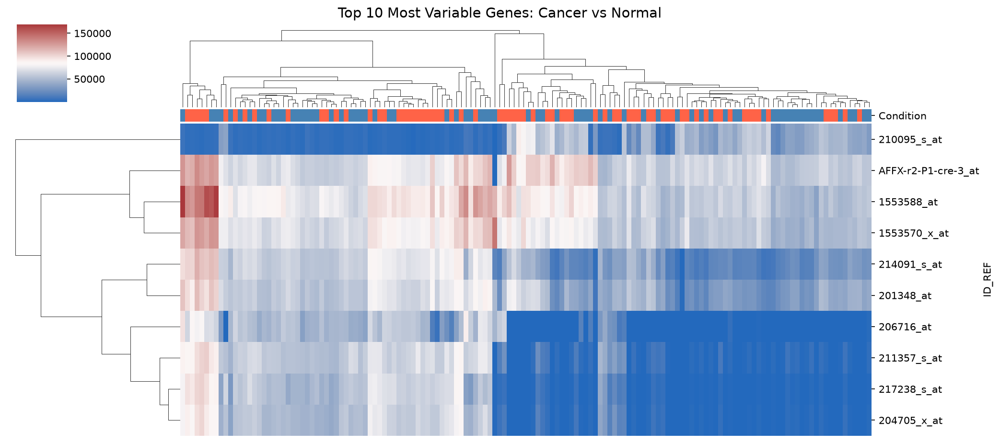
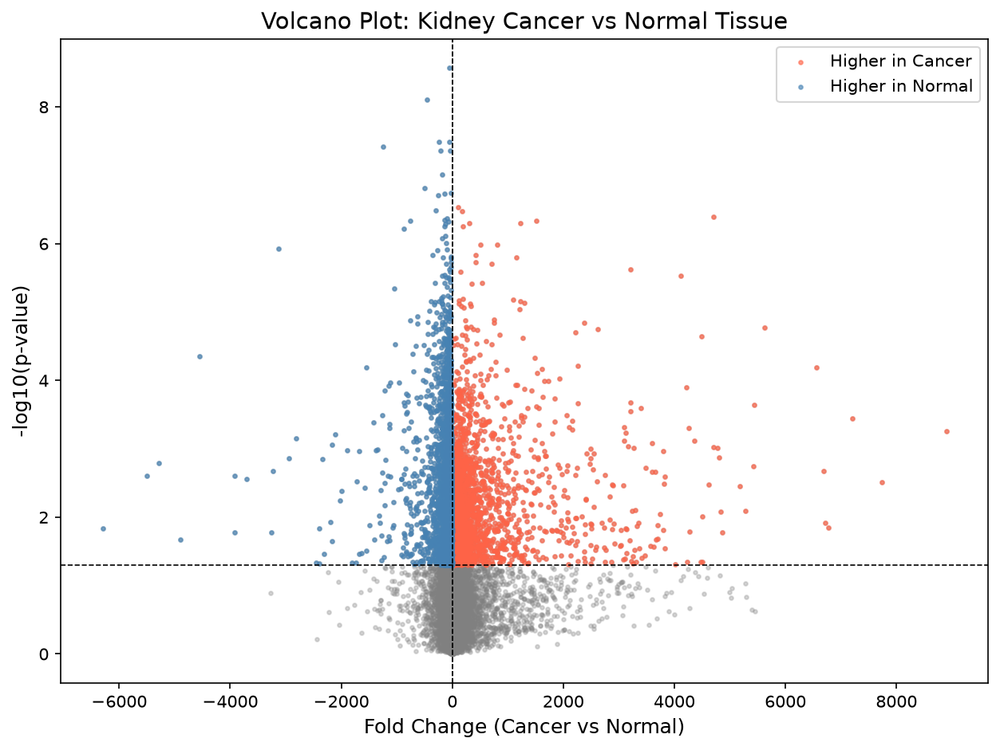

# Kidney Cancer Gene Expression Analysis

A bioinformatics project analyzing gene expression differences between 
kidney cancer and normal tissue using real patient data from NCBI GEO.

## Dataset
- Source: NCBI GEO (GSE53757)
- Samples: 144 patients (72 cancer, 72 normal)
- Genes measured: 54,675

## What I Did
1. Downloaded and cleaned a real RNA-seq dataset
2. Labeled cancer vs normal samples
3. Performed differential expression analysis
4. Generated visualizations

## Key Findings
- Found 7,996 statistically significant genes
- 2,871 genes higher in cancer tissue
- 5,125 genes suppressed in cancer tissue

## Visualizations

### Heatmap

### Volcano Plot

## Tools Used
- Python 3.14
- pandas, numpy, matplotlib, seaborn, scipy